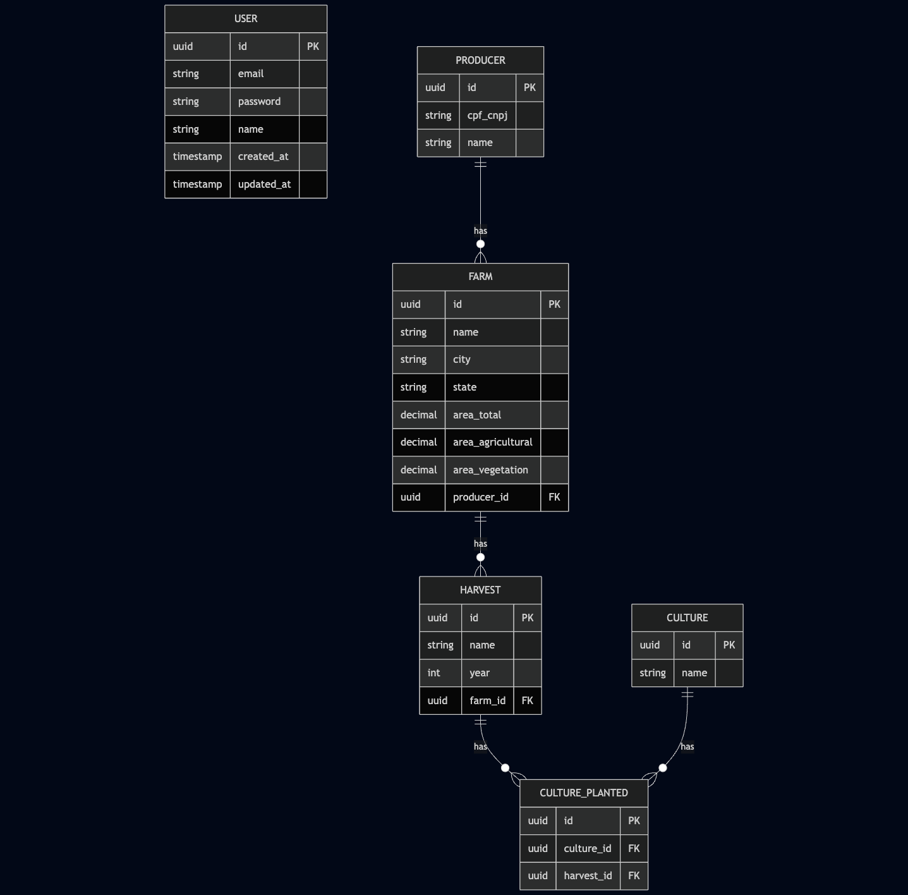

# 🧑‍🌾 Sistema de Gestão de Produtores Rurais

Aplicação backend desenvolvida com NestJS para o gerenciamento de produtores rurais, suas propriedades (fazendas), safras e culturas plantadas. A API segue boas práticas de arquitetura em camadas, validações robustas e estrutura modular.

---

## 📦 Tecnologias Utilizadas

- **NestJS**
- **PostgreSQL**
- **TypeORM**
- **Swagger (OpenAPI)**
- **Class-validator**
- **Arquitetura em camadas**
- **Docker**

---

## 🚀 Funcionalidades

### 👤 Produtor
- Cadastro, edição, listagem e exclusão de produtores rurais
- Validação de CPF ou CNPJ
- Associação com múltiplas fazendas

### 🌾 Fazenda
- Cadastro de fazendas vinculadas a produtores
- Validação da soma de áreas (agricultável + vegetação ≤ total)
- Armazenamento de localização da fazenda (cidade e estado)

### 🌱 Cultura e Safra
- Cadastro de culturas plantadas (ex: soja, milho, café)
- Registro de múltiplas culturas por safra e fazenda
- Associação de culturas plantadas a safras (via tabela `culture_planted`)

### 📊 Dashboard
- Total de fazendas cadastradas
- Total de hectares registrados
- Gráficos:
  - Por estado (quantidade de fazendas)
  - Por cultura plantada (distribuição)
  - Por uso do solo (área agricultável vs vegetação)

---

## 📁 Estrutura do Projeto

```bash
src/
├── modules/
│   ├── producer/
│   ├── farm/
│   ├── culture/
│   ├── harvest/
│   ├── dashboard/
├── shared/
├── main.ts
```

---

## 🧰 Pré-requisitos

- Node.js v18+
- PostgreSQL ou Docker
- Yarn ou NPM

---

## 📦 Instalação

```bash
$ git clone https://github.com/lucasoliveiraa/brain-backend.git
$ cd brain-backend

# .env
DATABASE_HOST=localhost
DATABASE_PORT=5432
DATABASE_USER=postgres
DATABASE_PASSWORD=root
DATABASE_DB=brain
SYNC_DB=false
PORT=3000
NODE_ENV=development
JWT_SECRET=your_jwt_secret

# Instalação
$ npm install
# ou
$ yarn install

# Docker
$ docker compose up -d

# modo desenvolvimento com watch
$ npm run start:dev

# ou
$ yarn start:dev
```

## 📚 Documentação da API

```bash
$ http://localhost:3000/v1/brain/doc
```

## 🔐 Autenticação com JWT

A API possui sistema de autenticação com JSON Web Token (JWT). Apenas usuários autenticados podem acessar rotas protegidas como:
 - Criar, editar e excluir produtores
 - Cadastrar fazendas, safras e culturas
 - Acessar o dashboard com dados consolidados

Endpoints públicos:
 - POST /authentication/signup → Cria novo usuário
 - POST /authentication/signin → Retorna JWT válido

Exemplo de uso:
  - Enviar o token no header:
```bash
  Authorization: Bearer <token>
```

Swagger:
 - Use o botão "Authorize" na interface Swagger e cole o JWT.
 - As rotas protegidas exibirão o cadeado 🔒 até serem autenticadas.

## 📚 Diagrama ER

<p align="center">
  
</p>

## 🚀 Autor

Made with 💜 by Lucas Oliveira 👋 [See my linkedin](https://www.linkedin.com/in/lucas-da-costa-oliveira-b75b30125/)
